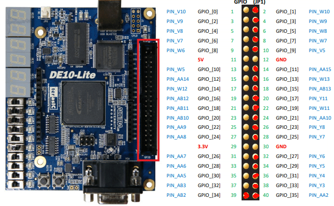

# DE10-Lite  Cheat Sheet

## PIN Assignment

### PIN Assignment of Clocks Inputs
| Signal Name | FPGA Pin No. | Desc |
|----------|----------|----------|
| ADC_CLK_10    | PIN_N5   | 10 Mhz clock input for ADC (Bank 3B)   |
| MAX10_CLK1_50    | PIN_P11   | 50 Mhz clock input for ADC (Bank 3B)   |
| MAX10_CLK2_50    | PIN_N14   | 50 Mhz clock input for ADC (Bank 3B)  |

### PIN Assignment of Push-buttons
| Signal Name | FPGA Pin No. | Desc |
|----------|----------|----------|
| KEY0    | PIN_B8   | Push-button[0] |
| KEY1    | PIN_A7   | Push-button[1] |

### PIN Assignment of Slide Switches
| Signal Name | FPGA Pin No. | Desc |
|----------|----------|----------|
| SW0    | PIN_C10   | Slide Switch[0] |
| SW1    | PIN_C11   | Slide Switch[1] |
| SW2    | PIN_D12   | Slide Switch[2] |
| SW3    | PIN_C12   | Slide Switch[3] |
| SW4    | PIN_A12   | Slide Switch[4] |
| SW5    | PIN_B12   | Slide Switch[5] |
| SW6    | PIN_A13   | Slide Switch[6] |
| SW7    | PIN_A14   | Slide Switch[7] |
| SW8    | PIN_B14   | Slide Switch[8] |
| SW9    | PIN_F15   | Slide Switch[9] |

### PIN Assignment of LEDs
| Signal Name | FPGA Pin No. | Desc |
|----------|----------|----------|
| LEDR0    | PIN_A8   | LED[0] |
| LEDR1    | PIN_A9   | LED[1] |
| LEDR2    | PIN_A10   | LED[2] |
| LEDR3    | PIN_B10   | LED[3] |
| LEDR4    | PIN_D13   | LED[4] |
| LEDR5    | PIN_C13   | LED[5] |
| LEDR6    | PIN_E14   | LED[6] |
| LEDR7    | PIN_D14   | LED[7] |
| LEDR8    | PIN_A11   | LED[8] |
| LEDR9    | PIN_B11   | LED[9] |

### PIN Assignment of 7-segment Displays
| Signal Name | FPGA Pin No. | Desc |
|----------|----------|----------|
|DISPLAY 0    |    | |
| HEX00    | PIN_C14   | Seven Segment Digit 0[0] |
| HEX01    | PIN_E15   | Seven Segment Digit 0[1] |
| HEX02    | PIN_C15   | Seven Segment Digit 0[2] |
| HEX03    | PIN_C16   | Seven Segment Digit 0[3] |
| HEX04    | PIN_E16   | Seven Segment Digit 0[4] |
| HEX05    | PIN_D17   | Seven Segment Digit 0[5] |
| HEX06    | PIN_C17   | Seven Segment Digit 0[6] |
| HEX07    | PIN_D15   | Seven Segment Digit 0[7], DP |
|DISPLAY 1    |    | |
| HEX10    | PIN_C18   | Seven Segment Digit 1[0] |
| HEX11    | PIN_D18   | Seven Segment Digit 1[1] |
| HEX12    | PIN_E18   | Seven Segment Digit 1[2] |
| HEX13    | PIN_B16   | Seven Segment Digit 1[3] |
| HEX14    | PIN_A17   | Seven Segment Digit 1[4] |
| HEX15    | PIN_A18   | Seven Segment Digit 1[5] |
| HEX16    | PIN_B17   | Seven Segment Digit 1[6] |
| HEX17    | PIN_A16   | Seven Segment Digit 1[7], DP |
|DISPLAY 2    |    | |
| HEX20    | PIN_B20   | Seven Segment Digit 2[0] |
| HEX21    | PIN_A20   | Seven Segment Digit 2[1] |
| HEX22    | PIN_B19   | Seven Segment Digit 2[2] |
| HEX23    | PIN_A21   | Seven Segment Digit 2[3] |
| HEX24    | PIN_B21   | Seven Segment Digit 2[4] |
| HEX25    | PIN_C22   | Seven Segment Digit 2[5] |
| HEX26    | PIN_B22   | Seven Segment Digit 2[6] |
| HEX27    | PIN_A19   | Seven Segment Digit 2[7], DP |
|DISPLAY 3    |    | |
| HEX30    | PIN_F21   | Seven Segment Digit 3[0] |
| HEX31    | PIN_E22   | Seven Segment Digit 3[1] |
| HEX32    | PIN_E21   | Seven Segment Digit 3[2] |
| HEX33    | PIN_C19   | Seven Segment Digit 3[3] |
| HEX34    | PIN_C20   | Seven Segment Digit 3[4] |
| HEX35    | PIN_D19   | Seven Segment Digit 3[5] |
| HEX36    | PIN_E17   | Seven Segment Digit 3[6] |
| HEX37    | PIN_D22   | Seven Segment Digit 3[7], DP |
|DISPLAY 4    |    | |
| HEX40    | PIN_F18   | Seven Segment Digit 4[0] |
| HEX41    | PIN_E20   | Seven Segment Digit 4[1] |
| HEX42    | PIN_E19   | Seven Segment Digit 4[2] |
| HEX43    | PIN_J18   | Seven Segment Digit 4[3] |
| HEX44    | PIN_H19   | Seven Segment Digit 4[4] |
| HEX45    | PIN_F19   | Seven Segment Digit 4[5] |
| HEX46    | PIN_F20   | Seven Segment Digit 4[6] |
| HEX47    | PIN_F17   | Seven Segment Digit 4[7], DP |
|DISPLAY 5    |    | | 
| HEX50    | PIN_J20   | Seven Segment Digit 5[0] |
| HEX51    | PIN_K20   | Seven Segment Digit 5[1] |
| HEX52    | PIN_L18   | Seven Segment Digit 5[2] |
| HEX53    | PIN_N18   | Seven Segment Digit 5[3] |
| HEX54    | PIN_M20   | Seven Segment Digit 5[4] |
| HEX55    | PIN_N19   | Seven Segment Digit 5[5] |
| HEX56    | PIN_N20   | Seven Segment Digit 5[6] |
| HEX57    | PIN_L19   | Seven Segment Digit 5[7], DP |

## GPIOs
